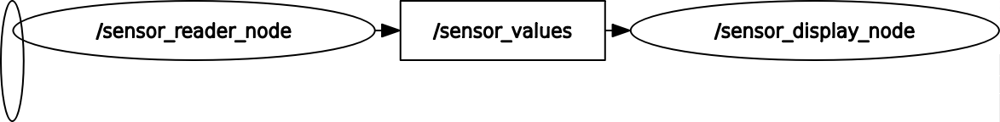
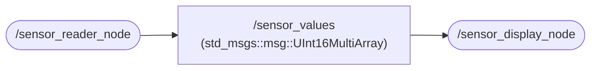
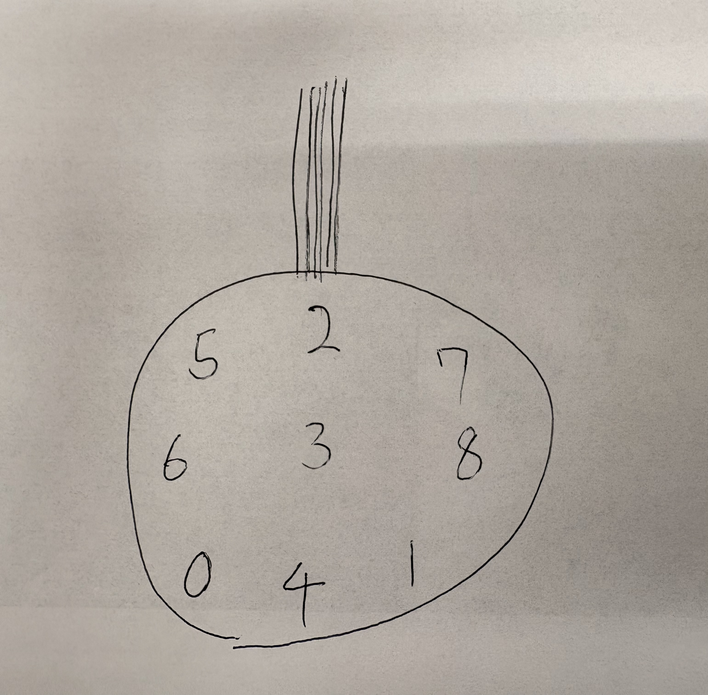

# tatto_pkg
## 🚀 Overview
This is Tatto repository.

## 🧩 Nodes & Topics
<!--  -->



## 🛠️ Setup
Get `tatto_pkg` package.
```bash
cd ~/ros2_ws/src
git clone https://github.com/iHaruruki/tatto_pkg.git
```
Build
```bash
cd ~/ros2_ws
colcon build --packages-select tatto_pkg
source install/setup.bash
```
## 🎮 How to use
### Launch Tatto / Tattoを起動する
Changes the permissions on the device file.
```bash
sudo chmod 666 /dev/ttyUSB0
```
Run serial connection / シリアル通信を開始
```bash
ros2 run tatto_pkg tatto_serial_node
```
Run display / ディスプレイに表示
```bash
ros2 run tatto_pkg tatto_display_node
```
topic echo / センサの値を見る
```bash
ros2 topic echo /sensor_values
```
Sensor placement / センサの配置位置  


### Record sensor values / センサデータを記録する
ros2 bag record / センサの値を記録する
```bash
ros2 bag record -a
```
ros2 bag play / 記録したものを再生する
```bash
cd ~/ros2_ws/rosbag
# ros2 bag play <file name　ここにディレクトリのパスを書く>
ros2 bag play $HOME/ros2_ws/rosbag/rosbag2_2025_11_10-17_46_24/
```
topic echo / 記録したセンサの値を見る
```bash
ros2 topic echo /sensor_values
```
Run display / 記録した値をディスプレイに表示
```bash
ros2 run tatto_pkg tatto_display_node
```


## :ghost: ROS 2 のプログラムを書いてみる！ 
### Node & Topic / NodeとTopicとは？
- What is Node? / Nodeとは？
Role: The smallest unit of a ROS 2 application (an object within a process). Each node handles a single responsibility such as sensor reading, inference, or control.  
役割：ROS 2 アプリの最小単位（プロセス内のオブジェクト）．センサ読み取り，推論，制御などの単機能を担当．  
Official documentation: [Understanding nodes](https://docs.ros.org/en/jazzy/Tutorials/Beginner-CLI-Tools/Understanding-ROS2-Nodes/Understanding-ROS2-Nodes.html)

-What is Topic? / Topicとは？
Role: A communication channel for stream-type messages between nodes in a loosely coupled fashion.  
役割：ノード間で非同期で情報のやりとりを行うメッセージ  
Official documentation: [Understanding topics](https://docs.ros.org/en/jazzy/Tutorials/Beginner-CLI-Tools/Understanding-ROS2-Topics/Understanding-ROS2-Topics.html)

### tattoのプログラムを書いてみる

## 📚 Reference