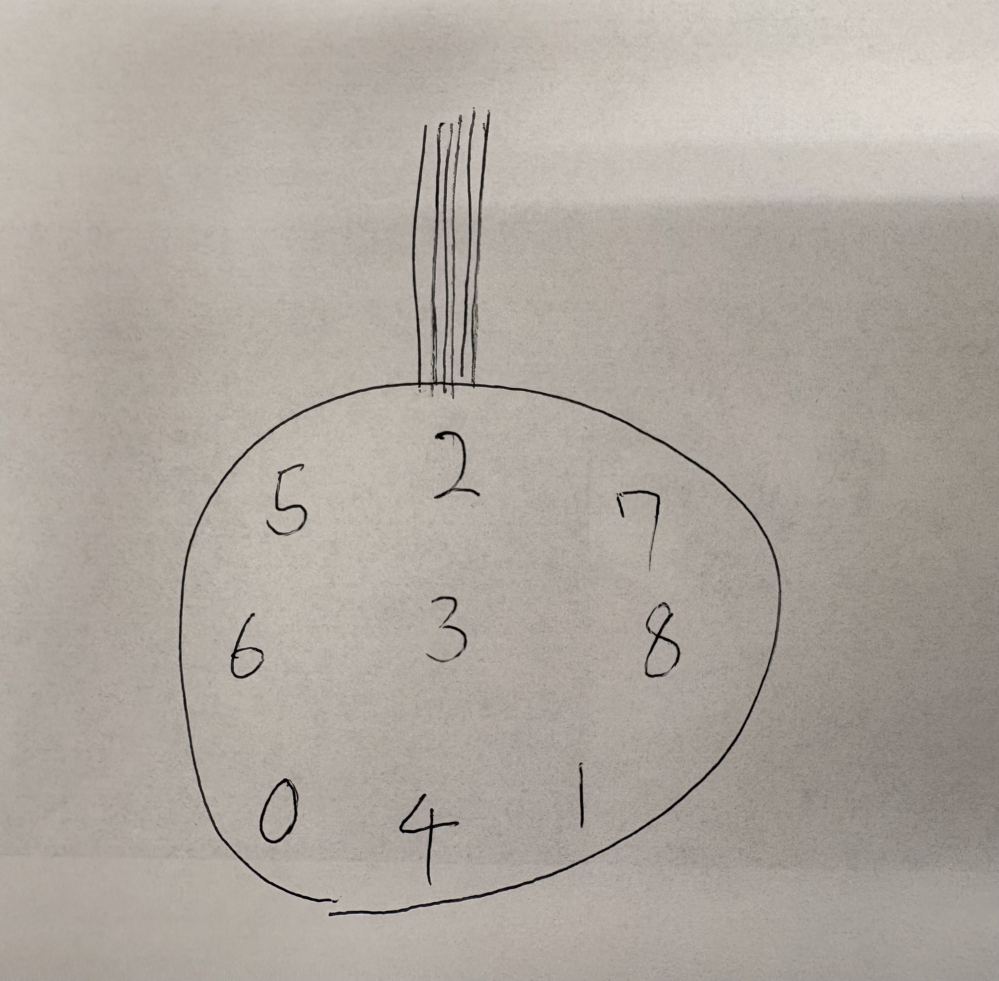

# tatto_pkg
[](https://docs.ros.org/en/humble/)
[](https://docs.ros.org/en/jazzy/)

## 🚀 Overview
This is Tatto repository.

## 🧩 Nodes & Topics
<!--  -->

<!-- ```mermaid
flowchart LR
    %% Nodes
    S([/sensor_reader_node])
    D([/sensor_display_node])

    %% Topics
    V["/sensor_values<br/>(std_msgs::msg::UInt16MultiArray)"]

    S --> V
    V --> D
``` -->

## 🛠️ Setup
> [!NOTE]
> Is your ROS2 environment ready?  
> [ros2 install](https://docs.ros.org/en/humble/Installation/Ubuntu-Install-Debs.html)


Get `tatto_pkg` package.
```bash
cd ~/ros2_ws/src
git clone https://github.com/iHaruruki/tatto_pkg.git
```
Build
```bash
cd ~/ros2_ws
colcon build --packages-select tatto_ros2_msgs
source install/setup.bash
colcon build --packages-select tatto_ros2
source install/setup.bash
```
## 🎮 How to use
### Launch Tatto / Tattoを起動する
Check USB conection
```bash
ls /dev/ttyUSB*
```
Output results / 出力結果
```bash
/dev/ttyUSB0
```
Changes the permissions on the device file.
```bash
sudo chmod 666 /dev/ttyUSB0
```

Run `sensor_reader_node` / シリアル通信を開始
```bash
ros2 run tatto_ros2 tatto_serial_node --ros-args -p port:=/dev/ttyUSB0
```
Run `sensor_display_node` / ディスプレイに表示
```bash
ros2 run tatto_ros2 tatto_display_node
```
To see the data being published on a topic / センサの値を見る
```bash
ros2 topic echo /tatto/sensor_values
```
Export topics in CSV format. / トピックをCSV形式で出力
```bash
ros2 topic echo /tatto/sensor_values --csv > output.csv
```

Sensor placement / センサの配置位置  


### Record sensor values / センサデータを記録する
ros2 bag record / センサの値を記録する
> [!TIP]
> With `sensor_reader_node` and `sensor_display_node` running, enter the following command.  
> `sensor_reader_node`と`sensor_display_node`を起動したまま，以下のコマンドを入力する
```bash
cd ~/ros2_ws/rosbag
ros2 bag record -a
```
ros2 bag play / 記録したものを再生する
> [!TIP]
> Now that the sensor_reader_node has stopped, enter the following command:
> `sensor_reader_node`は停止したから，以下のコマンドを入力
```bash
# ros2 bag play <The path to the directory where the record data is saved　ここにディレクトリのパスを書く>
ros2 bag play $HOME/ros2_ws/rosbag/rosbag2_2025_11_10-17_46_24/
```
topic echo / センサの値を見る
```bash
ros2 topic echo /sensor_values
```
Run `sensor_display_node` / ディスプレイに表示
```bash
ros2 run tatto_pkg tatto_display_node
```


## :ghost: ROS 2 のプログラムを書いてみる！ / Let's write a ROS 2 program!


## 📚 Reference
ROS 2 Official documentation
- [ROS 2-jazzy](https://docs.ros.org/en/jazzy/index.html)

## :bust_in_silhouette: Author
- [shotaarai1124](https://github.com/shotaarai1124)
- [sobasuki](https://github.com/sobasuki)
- [iHaruruki](https://github.com/iHaruruki)
